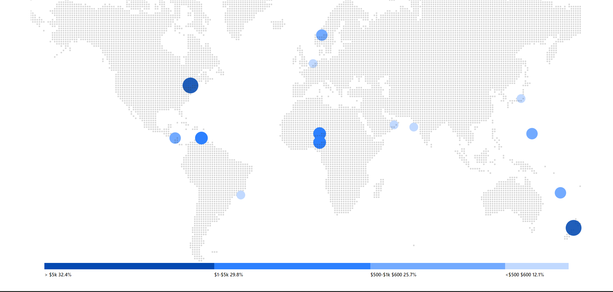

# Dotmapchart Component

The Dotmapchart component is a component that displays a map with dotted points representing Data Usage as per the region. It also includes horizontal progress bars to visualize the distribution of data points based on certain criteria.

## Features

- Displays a map with dotted points representing Data Usage points.
- Horizontal progress bars to visualize the distribution of data points based on certain criteria.
